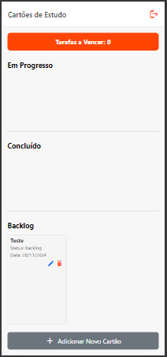
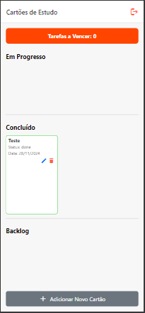

# Sobre
### Este aplicativo é um aplicativo de lembretes feitos com o Professor Kelson na aula de dispositivos móveis.

# Tecnologias Usadas

 
 
 

# Funcionalidades

<ul>
    <li>Autenticação via Firebase</li>
    <li>Lembretes com fases de andamento</li>
    <li>Edição dos cartões lembretes</li>
    <li>Exclusão ou adição de novos cartões com as tarefas</li>
</ul>

 

# Estrutura de pastas :file_folder:

## Configuração firebase

A configuração do Firebase usada para autenticação está na firebaseConfig.js, ela puxa os dados armazenados em um arquivo .env que fazem troca de informações com o Firebase, e então uma variável é criada para armazazenar os dados que serão usados para realizar a comunicação entre o aplicativo e o banco de dados.

## Contextos

### Contexto de autenticação :bust_in_silhouette:

Na pasta AuthContext.js é feito como acontece a autenticação de usuário, que inicial começa como vazio, após feito a autenticação do mesmo, o estado de usuário muda para logado quando é feito o seu registro, e também contém como acontece o Logout, onde o estado muda novamente para vazio, ou seja, sem nenhum usuário logado.

### Contexto dos cartões de estudo :notebook_with_decorative_cover:

No CartoesEstudoContext.js é onde são feitos os cartões de estudo usando a autenticação do usuário, onde se cria os cartões, apaga e edita os mesmos, a partir deste contexto so cartões podem ser mandados para o banco de dados aparecendo para seus respectivos usuários.

 

# Screens :iphone:

Nesta pasta contém os códigos que representam as telas que serão utilizadas pelo usuário, respectivamente para login, visualização dos cartões e edição dos cartões.

 
 Tela de login

 

 Tela que mostra os cartões

 

 Tela para editar cartão

 

 Cartão criado

 

 Cartão editado de progresso para backlog

 
 
 Cartão editado de backlog para concluído

 

# Bibliotecas usadas

<pre>
"@expo/metro-runtime": "~3.2.3",
    "@react-native-async-storage/async-storage": "^2.0.0",
    "@react-native-picker/picker": "github:react-native-picker/picker",
    "@react-navigation/native": "^6.1.18",
    "@react-navigation/native-stack": "^6.11.0",
    "@react-navigation/stack": "^6.4.1",
    "expo": "~51.0.28",
    "expo-local-authentication": "~14.0.1",
    "expo-status-bar": "~1.12.1",
    "firebase": "^11.0.1",
    "react": "18.2.0",
    "react-dom": "18.2.0",
    "react-native": "0.74.5",
    "react-native-async-storage": "^0.0.1",
    "react-native-dotenv": "^3.4.11",
    "react-native-modal-datetime-picker": "^18.0.0",
    "react-native-safe-area-context": "^4.11.1",
    "react-native-screens": "^3.34.1",
    "react-native-vector-icons": "^10.2.0",
    "react-native-web": "~0.19.10"
<code>